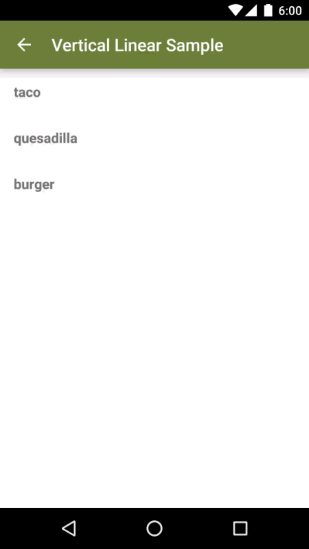
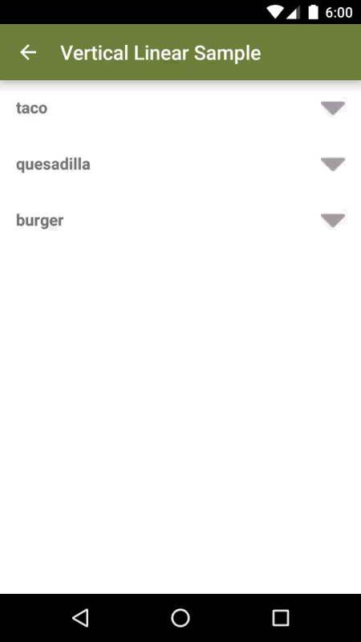

#Expandable Recycler View
A custom RecyclerView to allow for an expandable view to be attached to each ViewHolder.

<a href="http://www.methodscount.com/?lib=com.bignerdranch.android%3Aexpandablerecyclerview%3A2.0.4"></img></a>

## Overview

Expandable RecyclerView can be used with any stock Android `RecyclerView` to provide expandable items




## Usage

### Basic Setup

First, define a stock `RecyclerView` in a layout file and inflate it in an `Activity`/`Fragment` as normal.

Define the parent/child relationship by implementing `ParentListItem` and overriding `getChildItemList()`

```
public class Recipe implements ParentListItem {

	// a recipe contains several ingredients
    private List<Ingredient> mIngredients;

    public Recipe(List<Ingredient> ingredients) {
        mIngredients = ingredients;
    }

    @Override
    public List<?> getChildItemList() {
        return mIngredients;
    }

    @Override
    public boolean isInitiallyExpanded() {
        return false;
    }
}
```

Create two `ViewHolders` to hold parent and child views by extending `ParentViewHolder` and `ChildViewHolder` respectively. Handle the normal ViewHolder behavior by finding any views to be held, and implement a binding method.

```
public class RecipeViewHolder extends ParentViewHolder {

    private TextView mRecipeTextView;

    public RecipeViewHolder(View itemView) {
        super(itemView);
        mRecipeTextView = itemView.findViewById(R.id.recipe_textview);
    }

    public void bind(Recipe recipe) {
        mRecipeTextView.setText(recipe.getName());
    }
}
```

```
public class IngredientViewHolder extends ChildViewHolder {

    private TextView mIngredientTextView;

    public IngredientViewHolder(View itemView) {
        super(itemView);
        mIngredientTextView = itemView.findViewById(R.id.ingredient_textview);
    }

    public void bind(Ingredient ingredient) {
        mIngredientTextView.setText(ingredient.getName());
    }
}
```  

Next, create an adapter that extends `ExpandableRecyclerAdapter` and takes parent and child ViewHolders as generic types. Unlike a normal `RecyclerView.Adapter` with a single set of onCreate and onBind methods, `ExpandableRecyclerAdapter` has a set for parent and another set for child ViewHolders:

```
public class MyAdapter extends ExpandableRecyclerAdapter<RecipeViewHolder, IngredientViewHolder> {

    private LayoutInflater mInflator;

    public MyAdapter(Context context, @NonNull List<? extends ParentListItem> parentItemList) {
        super(parentItemList);
        mInflator = LayoutInflater.from(context);
    }

	// onCreate ...
    @Override
    public RecipeViewHolder onCreateParentViewHolder(ViewGroup parentViewGroup) {
        View recipeView = mInflator.inflate(R.layout.recipe_view, parentViewGroup, false);
        return new RecipeViewHolder(recipeView);
    }

    @Override
    public IngredientViewHolder onCreateChildViewHolder(ViewGroup childViewGroup) {
        View ingredientView = mInflator.inflate(R.layout.ingredient_view, childViewGroup, false);
        return new IngredientViewHolder(ingredientView);
    }

	// onBind ...
    @Override
    public void onBindParentViewHolder(RecipeViewHolder recipeViewHolder, int position, ParentListItem parentListItem) {
        Recipe recipe = (Recipe) parentListItem;
        recipeViewHolder.bind(recipe);
    }

    @Override
    public void onBindChildViewHolder(IngredientViewHolder ingredientViewHolder, int position, Object childListItem) {
        Ingredient ingredient = (Ingredient) childListItem;
        ingredientViewHolder.bind(ingredient);
    }
}
```

Finally, instantiate this adapter, passing in data, and hand to `RecyclerView`.

```
Ingredient beef = new Ingredient("beef");
Ingredient cheese = new Ingredient("cheese");
Ingredient salsa = new Ingredient("salsa");
Ingredient tortilla = new Ingredient("tortilla");

Recipe taco = new Recipe(Arrays.asList(beef, cheese, salsa, tortilla));
Recipe quesadilla = new Recipe(Arrays.asList(cheese, tortilla));
List<Recipe> recipes = Arrays.asList(taco, quesadilla);

mRecyclerView = (RecyclerView) findViewById(R.id.recyclerview);
MyAdapter adapter = new MyAdapter(this, recipes);
mRecyclerView.setAdapter(adapter);
```
 
#### Custom Expand/Collapse Button
By default, clicking the entire parent view will trigger expansion or collapsing. However, Expandable RecyclerView allows for one or more sub views to handle expansion/collapsing and ignore touch event on the parent view itself. 



The `ParentViewHolder` implementation should override `shouldItemViewClickToggleExpansion()` to return false. Then set a click listener on the desired button within the `ParentViewHolder` implementation and call `expandView()` to trigger the expansion or `collapseView()` to trigger a collapse.

```
public class RecipeViewHolder extends ParentViewHolder {

    private ImageView mArrowExpandImageView;
    private TextView mRecipeTextView;

    public RecipeViewHolder(View itemView) {
        super(itemView);
        mRecipeTextView = itemView.findViewById(R.id.recipe_textview);

        mArrowExpandImageView = (ImageView) itemView.findViewById(R.id.arrow_expand_imageview);
        mArrowExpandImageView.setOnClickListener(new View.OnClickListener() {
            @Override
            public void onClick(View v) {
                if (isExpanded()) {
                    collapseView();
                } else {
                    expandView();
                }
            }
        });
    }

    @Override
    public boolean shouldItemViewClickToggleExpansion() {
        return false;
    }

    ...

}
```

#### Listening for Expansion/Collapse Inside Parent ViewHolder
 
To provide additional functionality *inside* the Parent ViewHolder when it has been expanded or collapsed, simply implement `ParentViewHolder.onExpansionToggled(Boolean expanded)`. This is the perfect place to trigger additional transition animations, such as the rotating arrow animation in the above example.


#### Triggering Expansion/Collapse Programatically

Other components can trigger expansion/collapse programmatically. `ExpandableRecyclerAdapter` features `expandParent(int position)` and `expandParent(ParentListItem parent)` to expand a list item by its adapter position or by its own reference.
 
Similar methods exist for collapsing a list item: `collapseParent(int position)` and `collapseParent(ParentListItem parent)`. 


To expand or collapse all items in the list at once, use `expandAllParents()` and `collapseAllParents()`.
 
#### Listening for Expansion/Collapse Outside of the Adapter
While `ParentViewHolder.onExpansionToggled(boolean expanded)` is useful for listening for view changes *within* individual parent views in the RecyclerView, Expandable RecyclerView also allows listeners *outside* of the Adapter to be notified of expand/collapse events. Simply create a `ExpandableRecyclerAdapter.ExpandCollapseListener` implementation and passing that implementation to the Adapter.

```
MyAdapter adapter = new MyAdapter(this, recipes);

adapter.setExpandCollapseListener(new ExpandableRecyclerAdapter.ExpandCollapseListener() {
    @Override
    public void onListItemExpanded(int position) {
        Recipe expandedRecipe = recipes.get(position);
        // ...
    }

    @Override
    public void onListItemCollapsed(int position) {
        Recipe collapsedRecipe = recipes.get(position);
        // ...
    }
});

mRecyclerView.setAdapter(adapter);
```

 
#### Saving and Restoring Collapsed and Expanded States
It's possible to save the expanded/collapsed state of the items in the RecyclerView across device configuration changes, low memory, or any time onSavedInstance state would be called.


To save expanded/collapsed states call `        ExpandableRecyclerAdapter.onSaveInstanceState(Bundle savedInstanceState)`. To restore that state call `ExpandableRecyclerAdapter.onRestoreInstanceState(Bundle savedInstanceState)`. 

 
 ```
@Override
protected void onSaveInstanceState(Bundle savedInstanceState) {
    super.onSaveInstanceState(savedInstanceState);
    mAdapter.onSaveInstanceState(savedInstanceState);
}

@Override
protected void onRestoreInstanceState(@NonNull Bundle savedInstanceState) {
    super.onRestoreInstanceState(savedInstanceState);
    mAdapter.onRestoreInstanceState(savedInstanceState);
}
 ```

#### Data Manipulation

During the life of the `RecyclerView` items may be added and removed from the list. Please note that the traditional `notifyDataSetChanged()` of `RecyclerView.Adapter` does not work as intended.

 Instead Expandable RecyclerView provides a set of notify methods with the ability to inform the adapter of changes to the list of `ParentListItem`s.
 
 ```
 // Parent Changes
 notifyParentItemInserted(int parentPosition)
 notifyParentItemRemoved(int parentPosition)
 notifyParentItemChanged(int parentPosition)
 notifyParentItemRangeInserted(int parentPositionStart, int itemCount)
 
 // Child Changes
 notifyChildItemInserted(int parentPosition, int childPosition)
 notifyChildItemRemoved(int parentPosition, int childPosition)
 notifyChildItemChanged(int parentPosition, int childPosition)
 ```


##Download

[v2.0.4 AAR](http://repo1.maven.org/maven2/com/bignerdranch/android/expandablerecyclerview/2.0.4/expandablerecyclerview-2.0.4.aar)

**Gradle**

```
compile 'com.bignerdranch.android:expandablerecyclerview:2.0.4'
```

**Maven**

```
<dependency>
  <groupId>com.bignerdranch.android</groupId>
  <artifactId>expandablerecyclerview</artifactId>
  <version>2.0.4</version>
</dependency>
```


## Contributing
If you have an idea for a feature enhancement or a bug fix, we'd love to know! 
We handle issue tracking using GitHub's issue system, so feel free to add your comment there. We also welcome all pull requests.

The `dev` branch is used for future 2.X releases, so if you're adding a feature, we ask that you target the `dev` branch.
If you have a bug fix, targeting `master` is your best bet. This way, we're flexible to pull in bug fixes as soon as possible.


##License

**TODO** switch to Apache License

      The MIT License
      
      Copyright (c) 2015 Big Nerd Ranch
      
      Permission is hereby granted, free of charge, to any person obtaining a copy
      of this software and associated documentation files (the "Software"), to deal
      in the Software without restriction, including without limitation the rights
      to use, copy, modify, merge, publish, distribute, sublicense, and/or sell
      copies of the Software, and to permit persons to whom the Software is
      furnished to do so, subject to the following conditions:
      
      The above copyright notice and this permission notice shall be included in
      all copies or substantial portions of the Software.
      
      THE SOFTWARE IS PROVIDED "AS IS", WITHOUT WARRANTY OF ANY KIND, EXPRESS OR
      IMPLIED, INCLUDING BUT NOT LIMITED TO THE WARRANTIES OF MERCHANTABILITY,
      FITNESS FOR A PARTICULAR PURPOSE AND NONINFRINGEMENT. IN NO EVENT SHALL THE
      AUTHORS OR COPYRIGHT HOLDERS BE LIABLE FOR ANY CLAIM, DAMAGES OR OTHER
      LIABILITY, WHETHER IN AN ACTION OF CONTRACT, TORT OR OTHERWISE, ARISING FROM,
      OUT OF OR IN CONNECTION WITH THE SOFTWARE OR THE USE OR OTHER DEALINGS IN
      THE SOFTWARE.